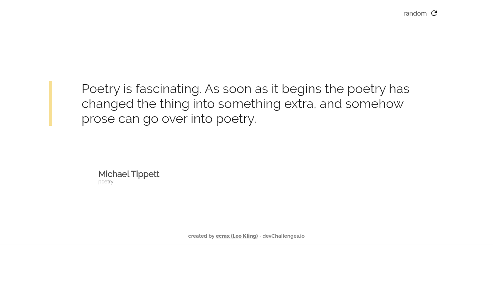

<!-- Please update value in the {}  -->

<h1 align="center">Random quote generator</h1>

<div align="center">
   Solution for a challenge from  <a href="http://devchallenges.io" target="_blank">Devchallenges.io</a>.
</div>

<div align="center">
  <h3>
    <a href="https://clever-tesla-02ef3b.netlify.app/#/">
      Demo
    </a>
    <span> | </span>
    <a href="https://github.com/ecrax/random_quote_generator/">
      Solution
    </a>
    <span> | </span>
    <a href="https://devchallenges.io/challenges/8Y3J4ucAMQpSnYTwwWW8">
      Challenge
    </a>
  </h3>
</div>

<!-- TABLE OF CONTENTS -->

## Table of Contents

- [Overview](#overview)
  - [Built With](#built-with)
- [Features](#features)
- [How to use](#how-to-use)
- [Acknowledgements](#acknowledgements)
- [Contact](#contact)

<!-- OVERVIEW -->

## Overview



**Where can I see your demo?**

[_here_](https://clever-tesla-02ef3b.netlify.app/#/)

**What have you learned/improved?**

- Flutter Web
- API Testing / Exploring
- How to use Insomnia as a great tool for API testing

**Your wisdom? :)**

Never stop learning.

### Built With

- [Flutter](https://flutter.dev/)

## Features

This application/site was created as a submission to a [DevChallenges](https://devchallenges.io/challenges) challenge. The [challenge](https://devchallenges.io/challenges/8Y3J4ucAMQpSnYTwwWW8) was to build an application that generates random quotes and to complete the given user stories.

## How To Use

<!-- For example: -->

To clone and run this application, you'll need [Git](https://git-scm.com) and [Flutter](https://flutter.dev/docs/get-started/install) installed on your computer.
For a more detailed guide have a look at [_this_](https://flutter.dev/docs/get-started/web)

From your command line:

```bash
# Clone this repository
$ git clone https://github.com/ecrax/random_quote_generator/

# Enable web support
$ flutter config --enable-web

# Install dependencies
$ flutter pub get

# Run the app (you may want to replace "chrome", depending on the browser you have installed)
$ flutter run -d chrome
```

## Acknowledgements

- [Google Fonts](https://fonts.google.com/)
- [Google Fonts Flutter package](https://pub.dev/packages/google_fonts)
- [Netlify](https://www.netlify.com/)
- [QuoteGarden](https://pprathameshmore.github.io/QuoteGarden/)

## Contact

- GitHub [@ecrax](https://github.com/ecrax)
- Twitter [@LeoKling\_](https://twitter.com/LeoKling_)
- YouTube [@ecrax](https://www.youtube.com/ecrax_official)
